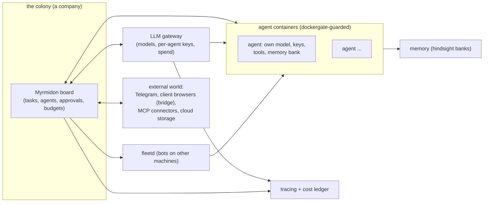

<div align="center">

# Myrmidon

**A control plane for a colony of AI agents that run a company's work.**

[What it is](#what-myrmidon-is) &middot; [The idea](#the-idea-the-ant-colony-model) &middot; [What it does today](#what-it-does-today) &middot; [Road to 2.0](#where-we-are-going-the-road-to-20) &middot; [Deploy](#quick-start--deploy) &middot; [Architecture](#architecture-at-a-glance)

English &middot; [Русский](README.ru.md)

</div>

---

## What Myrmidon is

Myrmidon is a self-hosted control plane for a colony of AI agents: a task
board where agents pick up work, run it in isolated containers with their own
model, keys and memory, report back, and ask a human only where a decision
needs one. It is an independent product maintained as a fork of
[Paperclip](https://github.com/paperclipai/paperclip) (MIT license, kept:
see [License and attribution](#license-and-attribution)); today's version is
1.5, and the project is built around one idea — an ant colony — described
next.

## The idea: the ant colony model

Myrmidon is named after the μυρμηδόνες, the mythic people-turned-ants. The
architecture it is growing toward is a colony: coordination through marks
left in a shared environment (stigmergy), a strict division of labor between
castes, and a continuous balance of the colony's computing energy. Real ants
run without a manager; the goal is an agent organization where work is
coordinated the same way — by signals in the environment, not by
micromanagement.

Each piece of the metaphor maps to something concrete in the product:

| Metaphor | What it is in Myrmidon | Status |
|---|---|---|
| **The nest** | A company on the board: its tasks, agents, secrets and budgets are isolated from other companies. Multi-company isolation is inherited from the base. | Works today |
| **The swarm** | The fleet of agents: each runs in its own container with its own model, keys, tools and memory bank. | Works today (see [bot-container-card](docs/myrmidon/guides/bot-container-card.md)) |
| **Pheromone trails** | Signals on work in the shared environment that guide who picks it up and what happens to it: issue labels, priority, wake-ups, review gates, blocker links. The board is the blackboard; a task's state, labels and relations are its scent. | The board and its signals work today; caste queues with pheromone-style labels and TTL-leased claiming arrive in the swarm-claim feature (planned, 1.6) |
| **Castes** | Roles for agents: today per-agent configuration of models, tool permissions and skills; the lead/overseer role reviews and approves. Strict model-based castes (heavy models audit, light models execute) are part of the swarm-claim design. | Per-agent configuration works today; caste queues are planned (1.6) |
| **Foraging** | Agents gathering knowledge in idle time: a research grant of tokens per agent, findings land as draft skills and go live only after approval. | Planned (1.6) |
| **The queen / overseer** | The lead agent and the human owner: the lead decomposes work, watches the board and reviews results; the owner approves what crosses the autonomy line. | Works today (board approvals, review gates, Telegram owner cards) |
| **Autonomy matrix** | A hard line between what the colony does on its own (claiming tasks, choosing libraries, isolated debates) and what needs a human (new regulations, budget expansion, the final push to production, public posts). | Approvals and gates work today; the matrix as a first-class core policy is planned (1.6) |
| **The colony's metabolism** | Budgets as computing energy: limits per company, per direction, per task; a hard stop for research, a soft stop (pause + question) for production work. | LLM spend tracking and budget signals work today; the full hierarchy of limits is planned (on the road to 2.0) |
| **Shared memory of the swarm** | The colony's experience outlives a single run: per-agent memory banks, reviewable from the agent card. | Works today (see [agent-memory-card](docs/myrmidon/guides/agent-memory-card.md)) |

Planned rows above belong to the roadmap (see
[Where we are going](#where-we-are-going-the-road-to-20)); nothing on this
page promises a date.

## What it does today

Release notes live in [docs/myrmidon/CHANGELOG.md](docs/myrmidon/CHANGELOG.md)
(Russian: [CHANGELOG.ru.md](docs/myrmidon/CHANGELOG.ru.md)). Highlights of
what exists as of 1.5:

- **The board and the work.** A task board with agents, org structure,
  approvals and review gates, wake-ups that do not get lost, and automatic
  recovery: a failed run leaves the agent in `error`, the board resumes it
  with a backoff and escalates when it keeps failing
  ([auto-resume](docs/myrmidon/guides/auto-resume.md)); a stalled run is
  interrupted and its task returned to the queue
  ([run-stall](docs/myrmidon/guides/run-stall.md)); a task with no live run
  wakes its idle agent.
- **Agents in isolated containers.** Each agent can run in a Docker container
  the board creates and maintains: its own image, CPU/memory/PID limits, its
  own LLM gateway key, its own memory bank, and its own tools — no server
  secrets ever reach a run
  ([bot-container-card](docs/myrmidon/guides/bot-container-card.md)).
- **The owner's channel.** Question and confirmation cards reach the owner's
  Telegram and can be answered there
  ([owner-telegram-cards](docs/myrmidon/guides/owner-telegram-cards.md));
  a run can show one live status message in the DM and split long answers
  ([telegram-dm-status](docs/myrmidon/guides/telegram-dm-status.md)); the
  board chat planner turns the owner's free text into a proposed epic with
  child tasks, approved by a card
  ([cto-chat-planner](docs/myrmidon/guides/cto-chat-planner.md)); the
  Commander chat of the 2.0 shell gives the same planning flow a screen —
  free-text entry with the proposed epic rendered read-only
  ([commander-chat](docs/myrmidon/guides/commander-chat.md)).
- **Company regulations in the wiki.** The rules agents follow are wiki pages
  with an audience of roles: an edit appends a draft revision and never
  changes what the fleet reads, the board approves or rolls back, and the
  approved text of the agent's role rides the compiled bot profile as
  `REGULATIONS.md` ([wiki-regulations](docs/myrmidon/guides/wiki-regulations.md)).
- **Memory per agent.** View, export and remove an agent's memory bank from
  its card ([agent-memory-card](docs/myrmidon/guides/agent-memory-card.md)).
- **Maintenance windows and safe deploys.** A maintenance window pauses new
  runs and queues wake-ups
  ([maintenance-banner](docs/myrmidon/guides/maintenance-banner.md));
  deploys are digest-pinned, CI-built images only, with a database dump
  before the switch and automatic rollback by health for the board and the
  whole bot fleet ([deploy](docs/myrmidon/deploy.md)).
- **Cost and tracing.** LLM spend collected from the gateway and attributed
  per agent, per run and per task; a budget stop that reaches the owner as a
  signal in the interrupted task instead of a silent cancel; an LLM tracing
  health card that surfaces lost traces before they pile up
  ([SETTINGS](docs/myrmidon/SETTINGS.md)).
- **Client connectors (the browser bridge).** A browser extension on a client
  PC dials out to the board, letting a company bot drive that browser — read,
  click, fill, download — and run any action the board marks for human
  confirmation only after a person on that PC presses Confirm, under an
  operator-set capability and domain policy, with signing steps that keep the
  key and the PIN on the client PC
  ([browser-bridge-gateway](docs/myrmidon/guides/browser-bridge-gateway.md),
  [bridge-extension](docs/myrmidon/guides/bridge-extension.md),
  [connector-panel](docs/myrmidon/guides/connector-panel.md),
  [signing-host-contract](docs/myrmidon/guides/signing-host-contract.md)).
- **OCR path.** PDF attachments recognized into text and a structural
  excerpt, on either an OpenAI-compatible gateway or a RAGFlow contour
  ([ocr](docs/myrmidon/guides/ocr.md)).
- **External MCP connectors.** Any standards-compliant HTTP MCP server plugs
  in without fork code; credentials become company secrets, per-agent grants
  default to deny
  ([external-mcp-connectors](docs/myrmidon/guides/external-mcp-connectors.md)).
- **Live browser console.** The owner watches and drives the live browser
  sessions bots authorize in ([browsers](docs/myrmidon/guides/browsers.md)).
- **Cloud storage.** Owner-connected cloud accounts with per-agent folder
  grants; tokens stay in the company secret store and never reach a bot
  ([cloud-files-connector](docs/myrmidon/guides/cloud-files-connector.md)).
- **Fleet operations.** Fleet servers for bots on other machines, a canary
  rollout for bot images, a stack registry of every component with its
  version ([stack-registry](docs/myrmidon/guides/stack-registry.md)), an
  access hub for secrets, grants and rotation
  ([access-hub](docs/myrmidon/guides/access-hub.md)), an emergency stop for
  runs left finishing by a pause
  ([emergency-stop](docs/myrmidon/guides/emergency-stop.md)), and run limits
  that survive a mass wake ([run-limits](docs/myrmidon/guides/run-limits.md)).
- **UI 2.0 shell.** The first piece of the 2.0 interface — the rail, the
  nest switcher, the design tokens — behind an instance flag, off by
  default ([ui2-shell](docs/myrmidon/guides/ui2-shell.md)).

Myrmidon sends no telemetry to the vendor. All settings are
`MYRMIDON_*` environment variables documented in
[docs/myrmidon/SETTINGS.md](docs/myrmidon/SETTINGS.md).

## Where we are going: the road to 2.0

Release groups only, no dates. The direction: first measure, then learn, then
grow the body.

- **1.6 — the swarm foundation and learning.** The baseline: cycle time,
  rejection rate and cost per task measured before anything changes. Eval
  sets for the pilot caste, with an automatic rollback of a "learned" rule
  when the metric drops. The autonomy matrix as a core policy. Swarm-claim:
  caste queues with pheromone-style labels, TTL-leased task claiming, a
  limit of tasks per agent, priority-0 preemption, the lead as overseer. The
  skill lifecycle: candidate → verified → stale, with rollback. Foraging:
  research grants, findings marked "unverified" become skills after
  approval. CTO chat: a WebSocket chat in the portal that turns the owner's
  plain language into epics and tasks. Wiki-cortex: regulations with
  revisions and approval.
- **1.7 — the swarm and the body, and the rebrand.** Asymmetric debates
  between different models with a judge outside the dispute. The colony
  grows its own body: an orchestrator-managed k3s cluster over VMs,
  hibernation of idle stateful agents, a second site for survivability.
  "Paperclip" disappears everywhere except the MIT license notice.
- **Toward 2.0 — clean-room rewrites and the full colony.** Much of the
  platform gets rewritten from specifications rather than ported, until no
  vendor code remains and the license notice can go too (after a legal
  check). Nests for external clients, short-lived keys, connectors, cloud
  bursting, a message bus for the swarm, sandboxes for debates. An
  architecture and code audit of the whole product pool before 2.0, and the
  new interface (UI 2.0) growing screen by screen through 1.6–1.7.

## Quick start / deploy

Myrmidon runs under docker compose from a CI-built image published at
`ghcr.io/itkadr-git/myrmidon`. Deploying, upgrading and rolling back is
covered end to end in [docs/myrmidon/deploy.md](docs/myrmidon/deploy.md) —
read it before the first install; it pins images by digest, refuses anything
not built by CI from `main` or a release tag, and rolls the board and the
release components (dockergate, fleetd) together.

Minimal steps:

1. Prepare a host with bash 4+, docker (with compose and buildx), curl, jq,
   git, and a clone of this repository (the deploy script checks the image
   commit against it).
2. Copy
   [`scripts/myrmidon/deploy/deploy.env.example`](scripts/myrmidon/deploy/deploy.env.example)
   to a private deploy repository and fill it in.
3. Pick the release digest from the Actions "Myrmidon image" workflow (or
   `docker buildx imagetools inspect`), then:

   ```sh
   scripts/myrmidon/deploy/deploy.sh --config /path/to/deploy.env --digest sha256:<digest> --dry-run
   scripts/myrmidon/deploy/deploy.sh --config /path/to/deploy.env --digest sha256:<digest>
   ```

4. Open the board in the browser and finish the setup (models, agents,
   channels) in the interface.

Upgrade notes per release (what changes for operators) are in the
"Upgrading" section of [docs/myrmidon/deploy.md](docs/myrmidon/deploy.md);
the changelog names the release each change landed in.

## Architecture at a glance



- The **board** is the thin orchestrator: tasks, agents, gates, budgets.
- Agents run in **isolated containers**; the board reaches the Docker daemon
  only through **dockergate**, an allowlisting proxy that passes exactly the
  calls the board's driver makes — and **fleetd** extends the same contract
  to bots on other machines.
- The **LLM gateway** routes every model call, carries per-agent keys, and
  feeds the **cost ledger**; **tracing health** is checked on the board.
- Each agent's **memory bank** is its own; experience is attributed, and the
  **browser bridge** / **MCP connectors** are the colony's receptors for the
  outside world.

## License and attribution

Myrmidon is MIT-licensed. It is based on
[Paperclip](https://github.com/paperclipai/paperclip) (version 2026.916.1),
Copyright (c) 2025 Paperclip AI, MIT License — see
[LICENSE](LICENSE) and [NOTICE](NOTICE). Myrmidon is not affiliated with or
endorsed by Paperclip AI. The Paperclip name remains in package names
(`@paperclipai/*`), environment variables (`PAPERCLIP_*`) and the
`paperclipai` CLI for compatibility only. Third-party notices kept in this
tree are listed in [NOTICE](NOTICE).
