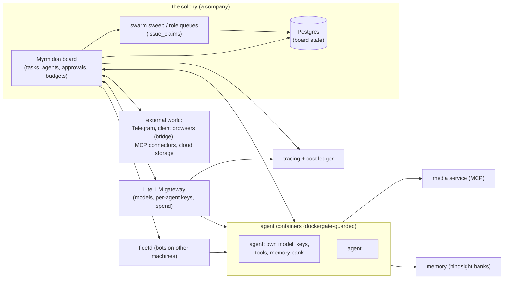

<div align="center">

# Myrmidon

**An orchestration platform for AI agents that run a company's work.**

[](https://github.com/itkadr-git/myrmidon/releases/latest)

[What it is](#what-myrmidon-is) &middot; [Why](#why-myrmidon) &middot; [Quick start](#quick-start--deploy) &middot; [Architecture](#architecture-at-a-glance) &middot; [Configuration](#configuration) &middot; [What it does today](#what-it-does-today) &middot; [The idea](#the-idea-the-ant-colony-model) &middot; [Road to 2.0](#where-we-are-going-the-road-to-20) &middot; [Upgrading](#upgrading)

English &middot; [Русский](README.ru.md)

</div>

---

## What Myrmidon is

Myrmidon is a self-hosted orchestration platform for AI agents: a task board
where agents pick up work, run it in isolated containers with their own model,
keys and memory, report back, and ask a human only where a decision needs one.
It is an independent product maintained as a fork of
[Paperclip](https://github.com/paperclipai/paperclip) (MIT license, kept: see
[License and attribution](#license-and-attribution)). Current release: see the
[latest release](https://github.com/itkadr-git/myrmidon/releases/latest) and
the [changelog](docs/myrmidon/CHANGELOG.md).

## Why Myrmidon

A fleet of AI agents needs what a team needs: a board, roles, budgets, review
and a way to ask the owner. Myrmidon gives agents isolation (a container, a key
and a memory bank each), accountability (every run, cost and approval is on the
board) and recovery (stalled runs resume, deploys roll back).

## Quick start / deploy

Myrmidon runs under docker compose from a CI-built image published at
`ghcr.io/itkadr-git/myrmidon`. Deploying, upgrading and rolling back is
covered end to end in [docs/myrmidon/deploy.md](docs/myrmidon/deploy.md) —
read it before the first install; it pins images by digest, refuses anything
not built by CI from `main` or a release tag, and rolls the board and the
release components (dockergate, fleetd) together.

Minimal steps:

1. Prepare a host with bash 4+, docker (with compose and buildx — buildx is
   needed to inspect the image digest), curl, jq, git, and a clone of this
   repository (the deploy script checks the image commit against it).
2. Copy
   [`scripts/myrmidon/deploy/deploy.env.example`](scripts/myrmidon/deploy/deploy.env.example)
   to a private deploy repository and fill it in.
3. Pick the release digest from the Actions "Myrmidon image" workflow (or
   `docker buildx imagetools inspect`), then:

   ```sh
   scripts/myrmidon/deploy/deploy.sh --config /path/to/deploy.env --digest sha256:<digest> --dry-run
   scripts/myrmidon/deploy/deploy.sh --config /path/to/deploy.env --digest sha256:<digest>
   ```

4. Check that the board is up: `curl <host>/api/health` returns the version
   (`myr-v…`). Then open the board in the browser and finish the setup
   (models, agents, channels) in the interface.

## Architecture at a glance



- The **board** is the thin orchestrator: tasks, agents, gates, budgets. All
  state lives in **Postgres**; the **swarm sweep** leases per-role task queues
  to agents (`issue_claims`).
- Agents run in **isolated containers**; the board reaches the Docker daemon
  only through **dockergate**, an allowlisting proxy that passes exactly the
  calls the board's driver makes — and **fleetd** extends the same contract
  to bots on other machines.
- The **LiteLLM gateway** routes every model call and feeds the **cost
  ledger**; **tracing health** is checked on the board.
- The **media service** keeps heavy tools (ffmpeg, LibreOffice, OCR, CAD) out
  of the bot image; the **browser bridge** and **MCP connectors** are the
  colony's receptors for the outside world.

## Configuration

Day-to-day setup happens in the interface: models and agents on their cards,
the autonomy matrix and the member list in Company Settings, the UI 2.0 shell
under Instance Settings → Experimental, and a per-user board language (RU/EN)
on the 2.0 "Language and formats" screen. Swarm queue parameters are edited
live in Instance settings; custom castes and model providers move into the
interface in 1.6.1 (in progress).

The 1.6 feature switches are still `MYRMIDON_*` environment variables, all off
by default — the full reference is
[docs/myrmidon/SETTINGS.md](docs/myrmidon/SETTINGS.md):

| Feature | How to enable | Default |
|---|---|---|
| Swarm claims (per-role queues) | `MYRMIDON_SWARM_CLAIM_ENABLED` | off |
| Foraging | `MYRMIDON_FORAGING_ENABLED` | off |
| CTO chat planner | `MYRMIDON_CTO_CHAT_BASE_URL` + `MYRMIDON_CTO_CHAT_KEY_SECRET` | off |
| Baseline metrics sweep | `MYRMIDON_BASELINE_INTERVAL_SEC` | off |
| Skill lifecycle pilot agents | `MYRMIDON_SKILL_PILOT_AGENTS` | empty |

## What it does today

Release notes live in [docs/myrmidon/CHANGELOG.md](docs/myrmidon/CHANGELOG.md)
(Russian: [CHANGELOG.ru.md](docs/myrmidon/CHANGELOG.ru.md)). Highlights of
what exists as of 1.6.4 (latest release; 1.6.5-rc.2 is the current release candidate):

### Work and agents

- **The board and the work.** A task board with agents, org structure,
  approvals and review gates; wake-ups do not get lost, a failed run is
  resumed with a backoff
  ([auto-resume](docs/myrmidon/guides/auto-resume.md)), a stalled run is
  interrupted and its task returned to the queue
  ([run-stall](docs/myrmidon/guides/run-stall.md)). A WIP limit caps how many
  tasks one agent holds in flight at once — set in Company Settings, shown live
  on every agent row, and flagged in the attention feed when over
  ([wip-limit](docs/myrmidon/guides/wip-limit.md)). A stale-block watchdog
  lifts blocks whose every reason is dead and says why in a system comment
  ([stale-block](docs/myrmidon/guides/stale-block.md)). A prompt-budget
  advisor on the agent card names the bloated part of the last run's prompt
  and the concrete fix, and one button files a cheap-model deep-analysis
  task ([prompt-budget-advice](docs/myrmidon/guides/prompt-budget-advice.md)).
- **Agents in isolated containers.** Each agent runs in a Docker container the
  board creates and maintains: its own image, CPU/memory/PID limits, its own
  LLM gateway key and its own tools — no server secrets reach a run
  ([bot-container-card](docs/myrmidon/guides/bot-container-card.md)). Coding
  roles get resource-capped language servers by policy; everyone else gets
  none ([bot-lsp](docs/myrmidon/guides/bot-lsp.md)). A shared package cache on
  the host keeps pnpm/Go/Gradle downloads once for all bots
  ([bot-disk-cache](docs/myrmidon/bot-disk-cache.md)).
- **The swarm.** Per-role task queues: an agent takes the top task of its
  role's queue behind a lease (TTL + heartbeat), an expired lease returns to
  the queue, a P0 task preempts, a per-agent active-task limit applies, and a
  supervisor view shows the queues and leases. Off until enabled — see
  [Configuration](#configuration); the swarm settings (lease TTL,
  limits) are edited live in Instance settings
  ([swarm-claim-settings](docs/myrmidon/guides/swarm-claim-settings.md)).
- **Parallel helpers.** Per-agent helper subagents with a company ceiling and
  a helper model — see [CHANGELOG](docs/myrmidon/CHANGELOG.md) (1.6.0).
- **Memory per agent.** View, export and remove an agent's memory bank from
  its card ([agent-memory-card](docs/myrmidon/guides/agent-memory-card.md)).

### Quality and learning

- **Baseline metrics.** Cycle time, time in review, return rate, blocked time,
  runs and LLM cost per task, by project and by role, on the Quality screen —
  with a comparison against the pinned baseline snapshot (current window,
  baseline, delta per row) right under the metrics tables
  ([guide](docs/myrmidon/guides/baseline-comparison.md),
  [CHANGELOG](docs/myrmidon/CHANGELOG.md), 1.6.0/1.6.5).
- **Reference-task evals.** An LLM judge scores the pilot role against a
  reference corpus; a regression verdict acts only after a confirmation run
  ([reference-task-evals](docs/myrmidon/guides/reference-task-evals.md)).
- **Skill lifecycle.** Company skills move `candidate → verified →
  deprecated`, with approval-gated promotion and rollback — see
  [CHANGELOG](docs/myrmidon/CHANGELOG.md) (1.6.0).
- **Foraging.** Agents gather knowledge in idle time; findings land as skill
  candidates and go live only after approval. Off by default
  ([foraging](docs/myrmidon/guides/foraging.md)).
- **Company regulations in the wiki.** Draft → approved revisions with
  rollback; the approved text for a role rides the bot profile as
  `REGULATIONS.md` ([wiki-regulations](docs/myrmidon/guides/wiki-regulations.md)).

### Channels

- **The owner's channel.** Question and confirmation cards reach the owner's
  Telegram and can be answered there
  ([owner-telegram-cards](docs/myrmidon/guides/owner-telegram-cards.md)); a
  run shows one live status message in the DM
  ([telegram-dm-status](docs/myrmidon/guides/telegram-dm-status.md)).
- **Any agent from one Telegram chat.** A bridged DM addresses any agent of
  the company with a `@`-mention or the `/agents`, `/to` and `/who` commands
  ([telegram-multi-agent](docs/myrmidon/guides/telegram-multi-agent.md)).
- **CTO chat.** The owner writes one free-text request and gets a proposed
  epic with child tasks, approved by a card
  ([cto-chat-planner](docs/myrmidon/guides/cto-chat-planner.md)); the
  Commander screen of the 2.0 shell gives the same flow a screen
  ([commander-chat](docs/myrmidon/guides/commander-chat.md)).

### Integrations

- **External MCP connectors.** Any standards-compliant HTTP MCP server plugs
  in without fork code; per-agent grants default to deny
  ([external-mcp-connectors](docs/myrmidon/guides/external-mcp-connectors.md)).
  A free image generation and editing connector runs as a container the bots
  reach the same way
  ([alibaba-image-connector](docs/myrmidon/guides/alibaba-image-connector.md)).
- **Cloud storage.** Owner-connected cloud accounts with per-agent folder
  grants; tokens stay in the company secret store
  ([cloud-files-connector](docs/myrmidon/guides/cloud-files-connector.md)).
- **Client connectors (the browser bridge).** A browser extension on a client
  PC dials out to the board; a bot drives that browser, and actions marked for
  human confirmation wait for a person on that PC. Details:
  [browser-bridge-gateway](docs/myrmidon/guides/browser-bridge-gateway.md) and
  the neighboring bridge guides.
- **OCR path.** PDF attachments recognized into text and a structural excerpt
  ([ocr](docs/myrmidon/guides/ocr.md)).
- **Shared media tools.** ffmpeg, LibreOffice, poppler, Tesseract and CAD
  conversion run in a separate media service the bots reach over MCP
  ([media-tools](docs/myrmidon/media-tools.md)).
- **Live browser console.** The owner watches and drives the live browser
  sessions bots authorize in ([browsers](docs/myrmidon/guides/browsers.md)).

### Operations

- **Maintenance windows and safe deploys.** A maintenance window pauses new
  runs and queues wake-ups
  ([maintenance-banner](docs/myrmidon/guides/maintenance-banner.md)); deploys
  are digest-pinned, CI-built images only, with a database dump before the
  switch and automatic rollback by health for the board and the whole bot
  fleet ([deploy](docs/myrmidon/deploy.md),
  [deploy-auto-rollback](docs/myrmidon/guides/deploy-auto-rollback.md)).
- **Stack updates.** The Stack screen shows release lag, patch status and an
  update planner; the whole cycle is documented
  ([stack-registry](docs/myrmidon/guides/stack-registry.md),
  [stack-updates](docs/myrmidon/stack-updates.md)).
- **Fleet operations.** Fleet servers for bots on other machines, a canary
  rollout for bot images, an access hub for secrets and rotation
  ([access-hub](docs/myrmidon/guides/access-hub.md)), an emergency stop for
  draining runs ([emergency-stop](docs/myrmidon/guides/emergency-stop.md)) and
  run limits that survive a mass wake
  ([run-limits](docs/myrmidon/guides/run-limits.md)), including admission by
  the host's free memory and a start ramp (1.6.2).
- **Cost, budgets and tracing.** LLM spend collected from the gateway and
  attributed per agent, run and task; budget enforcement is a mode — signal
  only, pause with a card to the owner, or hard refusal of new runs — set live
  for the instance
  ([budget-enforcement](docs/myrmidon/guides/budget-enforcement.md)); a
  tracing health card surfaces lost traces
  ([SETTINGS](docs/myrmidon/SETTINGS.md)).
- **UI 2.0 + language.** The 2.0 shell with six re-skinned data screens
  (behind the `enableMyrmidonUi2` flag, off by default) and a per-user board
  language RU/EN ([ui2-shell](docs/myrmidon/guides/ui2-shell.md)).

### New in the 1.6 line

Full notes per release: [CHANGELOG.md](docs/myrmidon/CHANGELOG.md) and the
[releases page](https://github.com/itkadr-git/myrmidon/releases) — latest is
[1.6.4](https://github.com/itkadr-git/myrmidon/releases/tag/myr-v1.6.4);
[1.6.5-rc.2](https://github.com/itkadr-git/myrmidon/releases/tag/myr-v1.6.5-rc.2)
is the current release candidate.

- **1.6.3 — one deploy for every component.** `deploy.sh --release` updates
  the board, dockergate, fleetd and the bot images in one all-or-nothing
  maintenance window: the digests come from a machine-readable release asset,
  bot cards that track the release image switch in small batches while their
  agents are idle, and a failing component rolls everything back together.
- **1.6.3 — a reviewer is assigned automatically.** A task that moves to
  `in_review` with no reviewer gets a one-stage review with the least-loaded
  agent of the reviewer roles — never the author — and an over-due review
  moves to another reviewer.
- **1.6.3 — live progress in the Telegram DM.** While a run is active, the
  one status message shows what the bot is doing and the last finished steps,
  edited in place.
- **1.6.3 — agent memory without a key, set in the UI.** The Memory tab works
  for a memory service without authentication, and the address and key are
  edited in Instance settings without a restart.
- **1.6.4 — board MCP tools renamed to `myrmidon*`.** Every tool of the board
  MCP server publishes under a `myrmidon*` name; the old `paperclip*` names
  stay registered as deprecated aliases for one release, so installed agents
  keep working ([mcp-tool-names](docs/myrmidon/guides/mcp-tool-names.md)).
- **1.6.4 — release records as per-PR fragments, and a fork-inheritance
  metric.** Changelog, divergence and settings entries land as one file per
  PR (no more append conflicts), folded at the release cut; a script measures
  how many files the fork still inherits from the vendor base.
- **1.6.5 (release candidate) — run admission by host CPU load.** A new run
  starts only while the host's load average per core stays under a
  configurable ceiling above the host's own background, so a mass wake can
  no longer saturate the host (see
  [run-limits](docs/myrmidon/guides/run-limits.md)).
- **1.6.5 (rc) — keep only the last verified backup.** An optional backup
  retention mode stream-verifies each new dump and only then deletes the
  previous ones; a dump that fails verification is deleted instead, leaving
  the older copies untouched.
- **1.6.5 (rc) — the review-return loop.** A review verdict that returns a
  pull request opens the rework task itself, blocks the review until the PR
  head moves, and wakes the reviewer with the new head.
- **1.6.5 (rc) — cheaper auxiliary calls, a calmer dockergate.** Auxiliary
  bot calls (titles, compression) follow a cheap fallback chain instead of
  climbing into a paid model, and the board's container layer polls
  dockergate at a fraction of its former rate.

### Privacy

Myrmidon sends no telemetry to the vendor. There are no vendor addresses in
the code, telemetry is off by default, and it can be enabled only with your
own collection endpoint.

## The idea: the ant colony model

Myrmidon is named after the μυρμηδόνες, the mythic people-turned-ants. The
architecture it is growing toward is a colony: coordination through marks left
in a shared environment (stigmergy), a strict division of labor between
castes, and a continuous balance of the colony's computing energy. Real ants
run without a manager; the goal is an agent organization where work is
coordinated the same way — by signals in the environment, not by
micromanagement.

Each piece of the metaphor maps to something concrete in the product
("Planned" rows belong to the roadmap below — nothing on this page promises a
date):

| Metaphor | What it is in Myrmidon | Status |
|---|---|---|
| **The nest** | A company on the board: its tasks, agents, secrets and budgets are isolated from other companies. Multi-company isolation is inherited from the base. | Works today |
| **The swarm** | The fleet of agents: each runs in its own container with its own model, keys, tools and memory bank. | Works today (see [bot-container-card](docs/myrmidon/guides/bot-container-card.md)) |
| **Pheromone trails** | Signals on work in the shared environment that guide who picks it up and what happens to it: issue labels, priority, wake-ups, review gates, blocker links. The board is the blackboard; a task's state, labels and relations are its scent. | Works today: per-role task queues with TTL-leased claims, P0 preemption and a per-agent task limit (off until `MYRMIDON_SWARM_CLAIM_ENABLED`; see [Configuration](#configuration)) |
| **Castes** | Roles as castes: per-role queues, model and tool configuration per agent, supervision by the lead. A custom caste directory (company registry of castes) is in 1.6.1 (in progress). | Works today |
| **Foraging** | Agents gathering knowledge in idle time: a source registry per role, snapshot comparison, and findings that land as skill candidates and go live only after approval. Ships off by default (`MYRMIDON_FORAGING_ENABLED`); the skill lifecycle (`candidate → verified → deprecated`) carries them further. | Works today, off by default; the learning switch and spend limits in the UI are 1.6.1 (in progress) |
| **The queen / overseer** | The lead agent and the human owner: the lead decomposes work, watches the board and reviews results; the owner approves what crosses the autonomy line. | Works today (board approvals, review gates, Telegram owner cards) |
| **Agent board administrators** | An agent the organization trusts with board administration: a **Board administrator** toggle in the agent card's Permissions tab, a badge row naming every agent administrator on the Members page, and the full grant semantics behind the flag — a fixed 17-key operator set, a snapshot that keeps personal grants on disable, and a self-toggle prohibition. | Works today (see [agent-board-admin](docs/myrmidon/guides/agent-board-admin.md)) |
| **Autonomy matrix** | A hard line between what the colony does on its own (claiming tasks, choosing libraries, isolated debates) and what needs a human (new regulations, budget expansion, the final push to production, public posts). | Works today: a role × action-class matrix with revisions, editable in Company Settings; enforcement at the point of action is still being extended |
| **The colony's metabolism** | Budgets as computing energy: limits per company, per direction, per task; a hard stop for research, a soft stop (pause + question) for production work. Baseline metrics (cycle time, return rate, cost per task) already exist on the Quality screen. | LLM spend tracking, budget signals and baseline metrics work today; the full hierarchy of limits is planned |
| **Shared memory of the swarm** | The colony's experience outlives a single run: per-agent memory banks, reviewable from the agent card. | Works today (see [agent-memory-card](docs/myrmidon/guides/agent-memory-card.md)) |

## Where we are going: the road to 2.0

Release groups only, no dates. The direction: first measure, then learn, then
grow the body.

- **Released: 1.6 — the swarm foundation and learning.** Per-role task queues
  with TTL-leased claims and P0 preemption; baseline metrics and the Quality
  screen; reference-task evals with an LLM judge; the skill lifecycle
  `candidate → verified → deprecated`; foraging; the autonomy matrix screen
  and API; CTO chat and the Commander screen; wiki regulations with revisions;
  parallel helpers; the stack update screen; the 2.0 shell behind a flag.
- **Next: 1.6.x (in progress).** Custom castes (a company directory), model
  providers managed from the interface, speech-to-text, @-addressing agents in
  Telegram, Telegram notification settings, learning limits in the interface,
  an agent as board administrator, a per-agent concurrent-task limit.
- **1.7 — the swarm and the body, and the rebrand.** Asymmetric debates
  between different models with a judge outside the dispute. The colony grows
  its own body: an orchestrator-managed k3s cluster over VMs, hibernation of
  idle stateful agents, a second site for survivability. "Paperclip"
  disappears everywhere except the MIT license notice.
- **Toward 2.0 — clean-room rewrites and the full colony.** Much of the
  platform gets rewritten from specifications rather than ported, until no
  vendor code remains and the license notice can go too (after a legal check).
  Nests for external clients, short-lived keys, connectors, cloud bursting, a
  message bus for the swarm, sandboxes for debates. An architecture and code
  audit of the whole product pool before 2.0, and the new interface (UI 2.0)
  growing screen by screen through 1.6–1.7.

## Upgrading

Upgrading uses the same script as installing:
`deploy.sh --config /path/to/deploy.env --digest sha256:<new digest>`. A
database dump is taken before the switch, and an unhealthy new version rolls
back automatically. The per-release operator notes are in the "Upgrading"
section of [docs/myrmidon/deploy.md](docs/myrmidon/deploy.md); the changelog
names the release each change landed in.

To roll back by hand: `scripts/myrmidon/deploy/rollback.sh --config
/path/to/deploy.env` (since 1.6.0 also `--local` — back to a local image
without pulling).

## License and attribution

Myrmidon is MIT-licensed. It is based on
[Paperclip](https://github.com/paperclipai/paperclip) (version 2026.916.1),
Copyright (c) 2025 Paperclip AI, MIT License — see
[LICENSE](LICENSE) and [NOTICE](NOTICE). Myrmidon is not affiliated with or
endorsed by Paperclip AI. The Paperclip name remains in package names
(`@paperclipai/*`), environment variables (`PAPERCLIP_*`) and the
`paperclipai` CLI for compatibility only. Third-party notices kept in this
tree are listed in [NOTICE](NOTICE).
