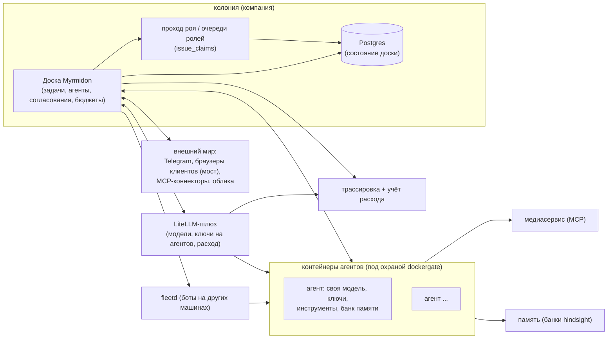

<div align="center">

# Myrmidon

**Система управления командой ИИ-агентов, которая ведёт работу компании.**

[](https://github.com/itkadr-git/myrmidon/releases/latest)

[Что это](#что-такое-myrmidon) &middot; [Зачем](#зачем-myrmidon) &middot; [Быстрый старт](#быстрый-старт--развёртывание) &middot; [Архитектура](#архитектура-одним-взглядом) &middot; [Настройка](#настройка) &middot; [Что умеет сегодня](#что-умеет-сегодня) &middot; [Идея](#идея-модель-муравейника) &middot; [Путь к 2.0](#куда-мы-идём-путь-к-20) &middot; [Обновление](#обновление)

[English](README.md) &middot; Русский

</div>

---

## Что такое Myrmidon

Myrmidon — система управления командой ИИ-агентов на своём сервере: доска задач,
на которой агенты разбирают работу, выполняют её в изолированных контейнерах
— со своей моделью, ключами и памятью, — отчитываются и спрашивают человека
только там, где нужно решение. Это самостоятельный продукт, развиваемый как
ответвление [Paperclip](https://github.com/paperclipai/paperclip) (лицензия MIT
сохраняется: см. [Лицензия и указание авторства](#лицензия-и-указание-авторства)).
Текущий выпуск: см. [последний
выпуск](https://github.com/itkadr-git/myrmidon/releases/latest) и [журнал
изменений](docs/myrmidon/CHANGELOG.ru.md).

## Зачем Myrmidon

Парку ИИ-агентов нужно то же, что команде: доска, роли, бюджеты, проверки и
способ спросить владельца. Myrmidon даёт изоляцию (у каждого агента свой
контейнер, ключ и память), подотчётность (каждый прогон, расход и одобрение
видны на доске) и восстановление (зависшие прогоны возобновляются, выкат
откатывается).

## Быстрый старт / развёртывание

Myrmidon работает под docker compose из образа, который собирает CI и
публикует в `ghcr.io/itkadr-git/myrmidon`. Развёртывание, обновление и откат
описаны целиком в [docs/myrmidon/deploy.md](docs/myrmidon/deploy.md) —
прочитайте перед первой установкой: образы фиксируются по digest, всё, что
не собрано CI из `main` или релизного тега, отказывается выкатываться, доска
и компоненты релиза (dockergate, fleetd) едут вместе.

Минимальные шаги:

1. Подготовьте хост: bash 4+, docker (с compose и buildx — buildx нужен для
   просмотра digest образа), curl, jq, git и клон этого репозитория (скрипт
   выката сверяет коммит образа с ним).
2. Скопируйте
   [`scripts/myrmidon/deploy/deploy.env.example`](scripts/myrmidon/deploy/deploy.env.example)
   в приватный deploy-репозиторий и заполните.
3. Возьмите digest релиза из workflow Actions «Myrmidon image» (или
   `docker buildx imagetools inspect`), затем:

   ```sh
   scripts/myrmidon/deploy/deploy.sh --config /path/to/deploy.env --digest sha256:<digest> --dry-run
   scripts/myrmidon/deploy/deploy.sh --config /path/to/deploy.env --digest sha256:<digest>
   ```

4. Проверьте, что доска поднялась: `curl <хост>/api/health` вернёт версию
   (`myr-v…`). Затем откройте доску в браузере и завершите настройку
   (модели, агенты, каналы) в интерфейсе.

## Архитектура одним взглядом



- **Доска** — тонкий оркестратор: задачи, агенты, гейты, бюджеты. Всё
  состояние — в **Postgres**; **проход роя** раздаёт агентам в аренду очереди
  задач по ролям (`issue_claims`).
- Агенты работают в **изолированных контейнерах**; доска доходит до Docker
  только через **dockergate** — allowlist-прокси, пропускающий ровно те
  вызовы, что делает драйвер доски, — а **fleetd** расширяет тот же контракт
  на ботов других машин.
- **LiteLLM-шлюз** маршрутизирует каждый вызов модели и питает **учёт
  расхода**; **здоровье трассировки** проверяется на доске.
- **Медиасервис** держит тяжёлые инструменты (ffmpeg, LibreOffice, OCR, CAD)
  вне образа бота; **браузерный мост** и **MCP-коннекторы** — рецепторы
  колонии для внешнего мира.

## Настройка

Повседневная настройка делается в интерфейсе: модели и агенты — в их
карточках, матрица автономии и список участников — в настройках компании,
оболочка UI 2.0 — в настройках экземпляра → Experimental, язык доски (RU/EN) —
у каждого пользователя на экране «Язык и форматы» интерфейса 2.0. Параметры
очередей роя правятся без перезапуска в настройках экземпляра; свои касты и провайдеры
моделей переезжают в интерфейс в 1.6.1 (в работе).

Переключатели функций 1.6 — пока переменные окружения `MYRMIDON_*`, все по
умолчанию выключены; полный справочник —
[docs/myrmidon/SETTINGS.ru.md](docs/myrmidon/SETTINGS.ru.md):

| Функция | Как включить | По умолчанию |
|---|---|---|
| Заявки роя (очереди по ролям) | `MYRMIDON_SWARM_CLAIM_ENABLED` | выкл. |
| Фуражировка | `MYRMIDON_FORAGING_ENABLED` | выкл. |
| Планировщик чата с доской | `MYRMIDON_CTO_CHAT_BASE_URL` + `MYRMIDON_CTO_CHAT_KEY_SECRET` | выкл. |
| Проход базовых метрик | `MYRMIDON_BASELINE_INTERVAL_SEC` | выкл. |
| Пилотные агенты жизненного цикла навыков | `MYRMIDON_SKILL_PILOT_AGENTS` | пусто |

## Что умеет сегодня

Релизные заметки — в [docs/myrmidon/CHANGELOG.ru.md](docs/myrmidon/CHANGELOG.ru.md)
(английская версия: [CHANGELOG.md](docs/myrmidon/CHANGELOG.md)). Главное на
версии 1.6.4 (последний выпуск; 1.6.5-rc.2 — текущий кандидат в выпуски):

### Работа и агенты

- **Доска и работа.** Доска задач с агентами, оргструктурой, одобрениями и
  контрольными проверками; побудки не теряются, сбойный прогон возобновляется с
  нарастающим интервалом
  ([auto-resume](docs/myrmidon/guides/auto-resume.ru.md)), зависший прогон
  прерывается, задача возвращается в очередь
  ([run-stall](docs/myrmidon/guides/run-stall.ru.md)). Лимит WIP ограничивает,
  сколько задач агент держит в полёте одновременно: задаётся в настройках
  компании, виден без перезапуска на каждой строке агента, а при превышении помечается
  в ленте внимания
  ([wip-limit](docs/myrmidon/guides/wip-limit.ru.md)). Сторож мёртвых блоков
  снимает блок, чьи причины все умерли, и называет причину в системном
  комментарии ([stale-block](docs/myrmidon/guides/stale-block.ru.md)).
  Советник бюджета промпта на карточке агента называет раздутую часть
  промпта последнего прогона и конкретное действие, а одна кнопка ставит
  задачу глубокого разбора на дешёвой модели
  ([prompt-budget-advice](docs/myrmidon/guides/prompt-budget-advice.ru.md)).
- **Агенты в изолированных контейнерах.** Каждый агент работает в
  Docker-контейнере, который создаёт и ведёт доска: свой образ, лимиты
  CPU/памяти/PID, свой ключ LLM-шлюза и свои инструменты — секреты сервера в
  прогон не попадают
  ([bot-container-card](docs/myrmidon/guides/bot-container-card.ru.md)).
  Пишущие код роли получают языковые серверы с урезанными ресурсами по
  политике; все остальные — без них
  ([bot-lsp](docs/myrmidon/guides/bot-lsp.ru.md)). Общий кэш пакетов на хосте
  хранит загрузки pnpm/Go/Gradle один раз на всех ботов
  ([bot-disk-cache](docs/myrmidon/bot-disk-cache.ru.md)).
- **Рой.** Очереди задач по ролям: агент берёт верхнюю задачу своей роли под
  аренду (TTL + heartbeat), истёкшая аренда возвращает задачу в очередь, P0
  вытесняет обычные, действует лимит активных задач на агента, а экран
  надзора отчитывается против замороженной базовой линии. Выключено до
  включения — см. [Настройка](#настройка); пилот (роли, компании, TTL аренды,
  лимиты) правится без перезапуска в настройках экземпляра
  ([swarm-claim-settings](docs/myrmidon/guides/swarm-claim-settings.ru.md)).
- **Параллельные помощники.** Подагенты-помощники на агента, общий потолок
  компании, модель помощников — см. [журнал
  изменений](docs/myrmidon/CHANGELOG.ru.md) (1.6.0).
- **Память на агента.** Просмотр, выгрузка и удаление банка памяти агента из
  его карточки
  ([agent-memory-card](docs/myrmidon/guides/agent-memory-card.ru.md)).

### Качество и обучение

- **Базовые метрики.** Время цикла, время на проверке, доля возвратов, время в
  блоке, прогоны и стоимость задачи — по проектам и по ролям, на экране
  Quality — см. [журнал изменений](docs/myrmidon/CHANGELOG.ru.md) (1.6.0).
- **Эталонные задачи.** LLM-судья оценивает пилотную роль по корпусу
  эталонов; вердикт о регрессе действует только после подтверждающего
  прогона
  ([reference-task-evals](docs/myrmidon/guides/reference-task-evals.ru.md)).
- **Жизненный цикл навыков.** Навыки компании идут `кандидат → проверен →
  устарел`, повышение — через одобрение, с откатом — см. [журнал
  изменений](docs/myrmidon/CHANGELOG.ru.md) (1.6.0).
- **Фуражировка.** Агенты собирают знания в свободное время; находки ложатся
  кандидатами в навыки и включаются только после одобрения. По умолчанию
  выключена ([foraging](docs/myrmidon/guides/foraging.ru.md)).
- **Регламенты компании в вики.** Ревизии «черновик → одобрено» с откатом;
  одобренный текст роли едет в профиль бота как `REGULATIONS.md`
  ([wiki-regulations](docs/myrmidon/guides/wiki-regulations.ru.md)).

### Каналы

- **Канал владельца.** Карточки вопросов и согласований доходят владельцу в
  Telegram и закрываются прямо там
  ([owner-telegram-cards](docs/myrmidon/guides/owner-telegram-cards.ru.md));
  прогон показывает одно живое статусное сообщение в диалоге
  ([telegram-dm-status](docs/myrmidon/guides/telegram-dm-status.ru.md)).
- **Любой агент из одной Telegram-лички.** Мостовая личка адресует любого
  агента компании `@`-упоминанием или командами `/agents`, `/to` и `/who`
  ([telegram-multi-agent](docs/myrmidon/guides/telegram-multi-agent.ru.md)).
- **Чат с Полководцем.** Владелец пишет один запрос свободным текстом и
  получает предложенный эпик с дочерними задачами, согласовываемый карточкой
  ([cto-chat-planner](docs/myrmidon/guides/cto-chat-planner.ru.md)); экран
  Полководца в оболочке 2.0 даёт тому же потоку экран
  ([commander-chat](docs/myrmidon/guides/commander-chat.ru.md)).

### Интеграции

- **Внешние MCP-коннекторы.** Любой стандартный HTTP MCP-сервер подключается
  без кода ответвления; права на агента по умолчанию запрещены
  ([external-mcp-connectors](docs/myrmidon/guides/external-mcp-connectors.ru.md)).
  Бесплатные генерация и правка картинок работают контейнером, к которому
  боты подключаются так же
  ([alibaba-image-connector](docs/myrmidon/guides/alibaba-image-connector.ru.md)).
- **Облачные хранилища.** Облака, подключённые владельцем, с выдачей папок
  агентам; токены остаются в хранилище секретов компании
  ([cloud-files-connector](docs/myrmidon/guides/cloud-files-connector.ru.md)).
- **Клиентские коннекторы (браузерный мост).** Расширение браузера на машине
  клиента само подключается к доске; бот управляет этим браузером, а действия,
  помеченные для подтверждения человеком, ждут человека за тем ПК. Подробнее:
  [browser-bridge-gateway](docs/myrmidon/guides/browser-bridge-gateway.ru.md)
  и соседние руководства моста.
- **Путь OCR.** PDF-вложения распознаются в текст и структурную выжимку
  ([ocr](docs/myrmidon/guides/ocr.ru.md)).
- **Общие медиа-инструменты.** ffmpeg, LibreOffice, poppler, Tesseract и
  конвертация чертежей работают в отдельном медиасервисе, куда боты ходят по
  MCP ([media-tools](docs/myrmidon/media-tools.ru.md)).
- **Живая консоль браузера.** Владелец видит и ведёт живые сессии браузера,
  которые авторизуют боты
  ([browsers](docs/myrmidon/guides/browsers.ru.md)).

### Эксплуатация

- **Окна обслуживания и безопасные выкаты.** Окно обслуживания останавливает
  новые прогоны и копит побудки в очереди
  ([maintenance-banner](docs/myrmidon/guides/maintenance-banner.ru.md));
  выкаты — только по digest, только образ из CI, с дампом базы перед
  переключением и автооткатом по здоровью для доски и всего парка ботов
  ([deploy](docs/myrmidon/deploy.ru.md),
  [deploy-auto-rollback](docs/myrmidon/guides/deploy-auto-rollback.ru.md)).
- **Обновления стека.** Экран Stack показывает отставание релизов, статус
  патчей и планировщик обновлений; весь цикл описан
  ([stack-registry](docs/myrmidon/guides/stack-registry.ru.md),
  [stack-updates](docs/myrmidon/stack-updates.ru.md)).
- **Операции парка.** Серверы парка (fleetd) для ботов на других машинах, канареечный
  выкат образа ботов, центр доступов для секретов и ротации
  ([access-hub](docs/myrmidon/guides/access-hub.ru.md)), аварийная остановка
  прогонов при осушающей паузе
  ([emergency-stop](docs/myrmidon/guides/emergency-stop.ru.md)) и лимиты
  прогонов, выдерживающие массовую побудку
  ([run-limits](docs/myrmidon/guides/run-limits.ru.md)), включая допуск по
  свободной памяти хоста и плавный старт (1.6.2).
- **Расход, бюджеты и трассировка.** Расход на LLM собирается со шлюза и
  атрибутируется по агенту, прогону и задаче; исполнение бюджета — режим:
  только сигнал, пауза с карточкой владельцу или жёсткий отказ новым
  прогонам, задаётся без перезапуска на экземпляр
  ([budget-enforcement](docs/myrmidon/guides/budget-enforcement.ru.md));
  карточка здоровья трассировки подсвечивает потерянные трейсы
  ([SETTINGS](docs/myrmidon/SETTINGS.ru.md)).
- **Интерфейс 2.0 и язык.** Оболочка 2.0 и шесть экранов на новых данных (за
  флагом `enableMyrmidonUi2`, по умолчанию выключено) и язык доски RU/EN на
  пользователя ([ui2-shell](docs/myrmidon/guides/ui2-shell.ru.md)).

### Новое в линейке 1.6

Полные заметки по каждому выпуску:
[CHANGELOG.ru.md](docs/myrmidon/CHANGELOG.ru.md) и [страница
выпусков](https://github.com/itkadr-git/myrmidon/releases) — последний:
[1.6.4](https://github.com/itkadr-git/myrmidon/releases/tag/myr-v1.6.4);
[1.6.5-rc.2](https://github.com/itkadr-git/myrmidon/releases/tag/myr-v1.6.5-rc.2)
— текущий кандидат в выпуски.

- **1.6.3 — один выкат для всех компонентов.** `deploy.sh --release`
  обновляет доску, dockergate, fleetd и образы ботов в одно окно
  обслуживания «всё или ничего»: отпечатки берутся из машиночитаемого
  вложения выпуска, карточки ботов на релизном образе переключаются
  небольшими партиями, пока их агенты свободны, а компонент, который не
  смог обновиться, откатывает всё вместе.
- **1.6.3 — проверяющий назначается автоматически.** Задача, ушедшая на
  проверку без проверяющего, получает одноэтапную проверку самым
  свободным агентом проверяющих ролей — никогда автором задачи, — а
  просроченная проверка уходит другому проверяющему.
- **1.6.3 — живые шаги в личке Telegram.** Пока прогон активен, одно
  сообщение статуса показывает, что бот делает, и последние завершённые
  шаги, обновляясь на месте.
- **1.6.3 — память агента без ключа, настраивается в интерфейсе.** Вкладка
  «Память» работает со службой памяти без аутентификации, а адрес и ключ
  правятся в настройках экземпляра без перезапуска.
- **1.6.4 — MCP-инструменты доски переименованы в `myrmidon*`.** Каждый
  инструмент MCP-сервера доски публикуется под именем `myrmidon*`; старые
  имена `paperclip*` остаются зарегистрированными устаревшими алиасами на
  один выпуск, так что установленные агенты продолжают работать
  ([mcp-tool-names](docs/myrmidon/guides/mcp-tool-names.ru.md)).
- **1.6.4 — записи реестров отдельными файлами на PR и метрика
  унаследованных файлов.** Записи журнала изменений, расхождений и
  настроек попадают в репозиторий по одному файлу на PR (конфликтов
  дозаписи больше нет) и сворачиваются при нарезке выпуска; скрипт
  измеряет, сколько файлов ответвление всё ещё наследует от исходного
  проекта.
- **1.6.5 (кандидат в выпуски) — допуск прогонов по загрузке процессора
  хоста.** Новый прогон стартует, только пока средняя загрузка на ядро
  держится ниже настраиваемого порога поверх собственного фона хоста, так
  что массовая побудка больше не может насытить хост (см.
  [run-limits](docs/myrmidon/guides/run-limits.ru.md)).
- **1.6.5 (кандидат) — хранить только последнюю проверенную копию базы.**
  Необязательный режим хранения копий потоково проверяет каждую новую
  копию и только после этого удаляет прежние; копия, не прошедшая
  проверку, удаляется сама, а прежние остаются нетронутыми.
- **1.6.5 (кандидат) — петля возврата с проверки.** Вердикт проверки,
  возвращающий pull request, сам открывает задачу доработки, держит
  проверку заблокированной, пока голова PR не сдвинется, и будит
  проверяющего с новой головой.
- **1.6.5 (кандидат) — дешевле вспомогательные вызовы, спокойнее
  dockergate.** Вспомогательные вызовы бота (заголовки, сжатие) идут по
  цепочке дешёвых моделей вместо подъёма в платную, а слой контейнеров
  доски опрашивает dockergate в разы реже прежнего.

### Приватность

Myrmidon не отправляет телеметрию вендору. В коде нет адресов вендора,
телеметрия выключена по умолчанию, включить её можно только со своим адресом
приёма.

## Идея: модель муравейника

Имя — от μυρμηδόνες, мифических людей-муравьёв. Архитектура, к которой растёт
Myrmidon, — колония: координация метками в общей среде (стигмергия), строгое
кастовое разделение труда и непрерывная балансировка вычислительной энергии
колонии. Настоящие муравьи обходятся без начальника; цель — агентская
организация, где работа координируется так же: сигналами в среде, а не
микроменеджментом.

Каждая часть метафоры отображается на конкретное в продукте (строки «План» —
из дорожной карты ниже; никаких сроков на этой странице нет):

| Метафора | Что это в Myrmidon | Статус |
|---|---|---|
| **Гнездо** | Компания на доске: её задачи, агенты, секреты и бюджеты изолированы от других компаний. Мультикомпанийность унаследована от базы. | Работает |
| **Рой** | Парк агентов: каждый работает в своём контейнере со своей моделью, ключами, инструментами и банком памяти. | Работает (см. [bot-container-card](docs/myrmidon/guides/bot-container-card.ru.md)) |
| **Феромонные дорожки** | Сигналы на работе в общей среде, которые ведут, кто её берёт и что с ней происходит: метки задач, приоритет, побудки, контрольные проверки, связи блокеров. Доска — общая доска (blackboard); состояние задачи, её метки и связи — её запах. | Работает: очереди задач по ролям с арендой (TTL), вытеснением P0 и лимитом задач на агента (выключено, пока не задано `MYRMIDON_SWARM_CLAIM_ENABLED`; см. [Настройка](#настройка)) |
| **Касты** | Роли как касты: очереди по ролям, модели и инструменты на агента, надзор у лида. Свои касты (справочник компании) — в 1.6.1, в работе. | Работает |
| **Фуражировка** | Сбор знаний агентами в свободное время: реестр источников по ролям, сравнение снимков, находки ложатся кандидатами в навыки и включаются только после одобрения. Поставляется выключенной (`MYRMIDON_FORAGING_ENABLED`); дальше находки несёт жизненный цикл навыков (`кандидат → проверен → устарел`). | Работает, выключена по умолчанию; включение и лимиты в интерфейсе — 1.6.1 (в работе) |
| **Королева / надзиратель** | Лид-агент и владелец-человек: лид декомпозирует работу, следит за доской и принимает результаты; владелец утверждает то, что переходит черту автономии. | Работает (согласования на доске, контрольные проверки, карточки владельцу в Telegram) |
| **Агенты-администраторы доски** | Агент, которому организация доверяет администрирование доски: переключатель **Board administrator** на вкладке Permissions карточки агента, строка со значком, называющая каждого агента-администратора на странице Members, и полная семантика прав за флагом — фиксированный операторский набор из 17 ключей, снимок, сохраняющий личные права при выключении, и запрет само-включения. | Работает ([agent-board-admin](docs/myrmidon/guides/agent-board-admin.ru.md)) |
| **Матрица автономии** | Жёсткая граница между тем, что колония делает сама (разбор задач, выбор библиотек, изолированные дебаты) и что требует человека (новые регламенты, расширение бюджета, финальный push в прод, публичные посты). | Работает: матрица роль × класс действий с ревизиями, правится в настройках компании; применение в точке действия расширяется |
| **Метаболизм колонии** | Бюджеты как вычислительная энергия: лимиты на компанию, на направление, на задачу; жёсткая остановка для исследований, мягкая (пауза + вопрос) для боевой работы. Базовые метрики (время цикла, доля возвратов, стоимость задачи) уже есть на экране Quality. | Учёт расхода, сигналы бюджета и базовые метрики работают; полная иерархия лимитов — план |
| **Общая память роя** | Опыт колонии переживает отдельный прогон: банки памяти на агента, просматриваемые из карточки. | Работает (см. [agent-memory-card](docs/myrmidon/guides/agent-memory-card.ru.md)) |

## Куда мы идём: путь к 2.0

Только группы релизов, без дат. Направление: сначала измерить, потом учиться,
потом растить тело.

- **Выпущено: 1.6 — фундамент роя и обучение.** Очереди задач по ролям с
  арендой (TTL) и вытеснением P0; базовые метрики и экран Quality; эталонные
  задачи с LLM-судьёй; жизненный цикл навыков `кандидат → проверен →
  устарел`; фуражировка; экран и API матрицы автономии; чат CTO и экран
  Полководца; вики-регламенты с ревизиями; параллельные помощники; экран
  обновлений стека; оболочка 2.0 за флагом.
- **Дальше: 1.6.x (в работе).** Свои касты (справочник компании), провайдеры
  моделей из интерфейса, голос в текст (STT), @-адресация агентов в Telegram,
  настройки Telegram-уведомлений, лимиты обучения в интерфейсе, агент —
  администратор доски, лимит одновременных задач на агента.
- **1.7 — рой и тело, ребрендинг.** Асимметричные дебаты разных моделей с
  судьёй вне спора. Колония растит собственное тело: кластер k3s под
  управлением оркестратора, гибернация простаивающих stateful-агентов, вторая
  площадка для живучести. Имя «Paperclip» исчезает везде, кроме лицензионной
  пометки MIT.
- **К 2.0 — переписывание в чистой комнате и полная колония.** Значительная
  часть платформы переписывается по спецификациям, а не переносится, пока
  кода вендора не останется и лицензионную пометку тоже можно будет снять
  (после юридической проверки). Гнёзда для внешних клиентов, ключи на время,
  коннекторы, облачная подкачка, шина сообщений для роя, песочницы для
  дебатов. Перед 2.0 — архитектурный и кодовый аудит всего пула продуктов;
  новый интерфейс (UI 2.0) растёт экран за экраном через 1.6–1.7.

## Обновление

Обновление — тот же скрипт, что и установка:
`deploy.sh --config /path/to/deploy.env --digest sha256:<новый digest>`. Перед
переключением снимается дамп базы, а нездоровая новая версия откатывается
автоматически. Заметки для оператора по каждому релизу — в разделе
«Upgrading» документа [docs/myrmidon/deploy.md](docs/myrmidon/deploy.md);
релиз каждого изменения назван в журнале изменений.

Откат вручную: `scripts/myrmidon/deploy/rollback.sh --config
/path/to/deploy.env` (с 1.6.0 — также `--local`, на локальный образ без
скачивания).

## Лицензия и указание авторства

Myrmidon распространяется под MIT. Он основан на
[Paperclip](https://github.com/paperclipai/paperclip) (версия 2026.916.1),
Copyright (c) 2025 Paperclip AI, лицензия MIT — см. [LICENSE](LICENSE) и
[NOTICE](NOTICE). Myrmidon не связан с Paperclip AI и не одобрен ими. Имя
Paperclip остаётся в именах пакетов (`@paperclipai/*`), переменных окружения
(`PAPERCLIP_*`) и CLI `paperclipai` только ради совместимости. Сторонние
уведомления, сохранённые в дереве, перечислены в [NOTICE](NOTICE).
