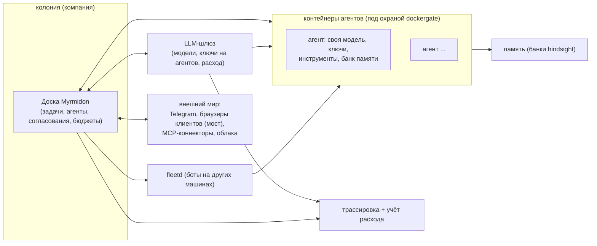

<div align="center">

# Myrmidon

**Плоскость управления колонией ИИ-агентов, которая ведёт работу компании.**

[Что это](#что-такое-myrmidon) &middot; [Идея](#идея-модель-муравейника) &middot; [Что умеет сегодня](#что-умеет-сегодня) &middot; [Путь к 2.0](#куда-мы-идём-путь-к-20) &middot; [Развёртывание](#быстрый-старт--развёртывание) &middot; [Архитектура](#архитектура-одним-взглядом)

[English](README.md) &middot; Русский

</div>

---

## Что такое Myrmidon

Myrmidon — self-hosted плоскость управления колонией ИИ-агентов: доска задач,
на которой агенты разбирают работу, выполняют её в изолированных контейнерах
— со своей моделью, ключами и памятью, — отчитываются и спрашивают человека
только там, где нужно решение. Это самостоятельный продукт, развиваемый как
форк [Paperclip](https://github.com/paperclipai/paperclip) (лицензия MIT
сохраняется: см. [Лицензия и указание авторства](#лицензия-и-указание-авторства));
текущая версия — 1.5, и вокруг одной идеи — муравейника — описана ниже.

## Идея: модель муравейника

Имя — от μυρμηδόνες, мифических людей-муравьёв. Архитектура, к которой растёт
Myrmidon, — колония: координация метками в общей среде (стигмергия), строгое
кастовое разделение труда и непрерывная балансировка вычислительной энергии
колонии. Настоящие муравьи обходятся без начальника; цель — агентская
организация, где работа координируется так же: сигналами в среде, а не
микроменеджментом.

Каждая часть метафоры отображается на конкретное в продукте:

| Метафора | Что это в Myrmidon | Статус |
|---|---|---|
| **Гнездо** | Компания на доске: её задачи, агенты, секреты и бюджеты изолированы от других компаний. Мультикомпанийность унаследована от базы. | Работает сегодня |
| **Рой** | Флот агентов: каждый работает в своём контейнере со своей моделью, ключами, инструментами и банком памяти. | Работает сегодня (см. [bot-container-card](docs/myrmidon/guides/bot-container-card.ru.md)) |
| **Феромонные дорожки** | Сигналы на работе в общей среде, которые ведут, кто её берёт и что с ней происходит: метки задач, приоритет, побудки, гейты ревью, связи блокеров. Доска — общая доска (blackboard); состояние задачи, её метки и связи — её запах. | Доска и её сигналы работают сегодня; очереди каст с метками-феромонами и захватом с арендой (TTL) приходят в swarm-claim (план, 1.6) |
| **Касты** | Роли агентов: сегодня — настройка моделей, прав на инструменты и навыков на каждого агента; роль лида-надзирателя — ревью и согласование. Строгие касты на моделях (тяжёлые модели аудируют, лёгкие исполняют) — часть замысла swarm-claim. | Настройка на агента работает сегодня; очереди каст — план (1.6) |
| **Фуражировка** | Сбор знаний агентами в свободное время: реестр источников по ролям, сравнение снимков, находки ложатся кандидатами в навыки и включаются только после одобрения. Поставляется выключенной (`MYRMIDON_FORAGING_ENABLED`). | Работает сегодня, выключена по умолчанию (см. [foraging](docs/myrmidon/guides/foraging.ru.md)) |
| **Королева / надзиратель** | Лид-агент и владелец-человек: лид декомпозирует работу, следит за доской и принимает результаты; владелец утверждает то, что переходит черту автономии. | Работает сегодня (одобрения на доске, гейты ревью, карточки владельцу в Telegram) |
| **Агенты-администраторы доски** | Агент, которому организация доверяет администрирование доски: переключатель **Board administrator** на вкладке Permissions карточки агента, строка с бейджем, называющая каждого агента-администратора на странице Members, и полная семантика грантов за флагом — фиксированный операторский набор из 17 ключей, снимок, сохраняющий личные гранты при выключении, и запрет само-включения. | Работает сегодня ([agent-board-admin](docs/myrmidon/guides/agent-board-admin.ru.md)) |
| **Матрица автономии** | Жёсткая граница между тем, что колония делает сама (разбор задач, выбор библиотек, изолированные дебаты) и что требует человека (новые регламенты, расширение бюджета, финальный push в прод, публичные посты). | Одобрения и гейты работают сегодня; матрица как первоклассная политика ядра — план (1.6) |
| **Метаболизм колонии** | Бюджеты как вычислительная энергия: лимиты на компанию, на направление, на задачу; жёсткая остановка для исследований, мягкая (пауза + вопрос) для боевой работы. | Учёт расхода и сигналы бюджета работают сегодня; полная иерархия лимитов — план (на пути к 2.0) |
| **Общая память роя** | Опыт колонии переживает отдельный прогон: банки памяти на агента, просматриваемые из карточки. | Работает сегодня (см. [agent-memory-card](docs/myrmidon/guides/agent-memory-card.ru.md)) |

Строки «план» выше — из дорожной карты (см. [Куда мы идём](#куда-мы-идём-путь-к-20));
никаких сроков на этой странице нет.

## Что умеет сегодня

Релизные заметки — в [docs/myrmidon/CHANGELOG.md](docs/myrmidon/CHANGELOG.md)
(русская версия: [CHANGELOG.ru.md](docs/myrmidon/CHANGELOG.ru.md)). Главное
на версии 1.5:

- **Доска и работа.** Доска задач с агентами, оргструктурой, одобрениями и
  гейтами ревью, побудки не теряются, восстановление автоматично: сбойный
  прогон оставляет агента в `error`, доска сама возобновляет его с
  нарастающим интервалом и эскалирует, когда не выходит
  ([auto-resume](docs/myrmidon/guides/auto-resume.ru.md)); зависший прогон
  прерывается, задача возвращается в очередь
  ([run-stall](docs/myrmidon/guides/run-stall.ru.md)); задача без живого
  прогона будит свободного агента.
- **Агенты в изолированных контейнерах.** Каждый агент может работать в
  Docker-контейнере, который создаёт и ведёт доска: свой образ, лимиты
  CPU/памяти/PID, свой ключ LLM-шлюза, свой банк памяти и свои инструменты —
  секреты сервера в прогон не попадают
  ([bot-container-card](docs/myrmidon/guides/bot-container-card.ru.md)).
- **Канал владельца.** Карточки вопросов и согласований доходят владельцу в
  Telegram и закрываются прямо там
  ([owner-telegram-cards](docs/myrmidon/guides/owner-telegram-cards.ru.md));
  прогон может показывать одно живое статусное сообщение в диалоге и делить
  длинные ответы
  ([telegram-dm-status](docs/myrmidon/guides/telegram-dm-status.ru.md));
  планировщик чата с доской превращает свободный текст владельца в
  предложенный эпик с дочерними задачами, согласовываемый карточкой
  ([cto-chat-planner](docs/myrmidon/guides/cto-chat-planner.ru.md)); чат
  с Полководцем в оболочке 2.0 даёт тому же потоку планирования экран —
  ввод свободным текстом, предложенный эпик только на чтение
  ([commander-chat](docs/myrmidon/guides/commander-chat.ru.md)).
- **Регламенты компании в вики.** Правила, по которым работают агенты, —
  страницы вики с аудиторией из ролей: правка добавляет ревизию-черновик и
  не меняет то, что читает флот, board одобряет или откатывает, а
  одобренный текст роли агента едет в скомпилированный профиль бота как
  `REGULATIONS.md` ([wiki-regulations](docs/myrmidon/guides/wiki-regulations.ru.md)).
- **Общие медиа-инструменты для контейнерных ботов.** Образ бота остаётся
  лёгким: ffmpeg, LibreOffice, poppler, Tesseract и конвертация чертежей
  (инструмент `dwg_convert`, DWG/DXF в DXF/SVG/PDF) работают в отдельном
  медиасервисе, куда боты ходят по MCP, с личным хранилищем файлов, квотами и
  списком инструментов на бота
  ([media-tools](docs/myrmidon/media-tools.ru.md)).
- **Память на агента.** Просмотр, выгрузка и удаление банка памяти агента из
  его карточки ([agent-memory-card](docs/myrmidon/guides/agent-memory-card.ru.md)).
- **Окна обслуживания и безопасные выкаты.** Окно обслуживания останавливает
  новые прогоны и копит побудки в очереди
  ([maintenance-banner](docs/myrmidon/guides/maintenance-banner.ru.md));
  выкаты — только по digest, только образ из CI, с дампом базы перед
  переключением и автооткатом по здоровью для доски и всего флота ботов
  ([deploy](docs/myrmidon/deploy.ru.md)).
- **Расход и трассировка.** Расход на LLM собирается со шлюза и
  атрибутируется по агенту, прогону и задаче; остановка бюджета доходит до
  владельца сигналом в прерванной задаче, а не тихой отменой; карточка
  здоровья трассировки LLM подсвечивает потерянные трейсы до того, как их
  накопится ([SETTINGS](docs/myrmidon/SETTINGS.ru.md)).
- **Клиентские коннекторы (браузерный мост).** Расширение браузера на машине
  клиента само подключается к доске, и бот компании управляет этим браузером
  — читает, кликает, заполняет, скачивает — а действие, помеченное доской
  для подтверждения человеком, выполняется только после того, как человек
  за этим ПК нажмёт Confirm; всё под политикой возможностей и доменов,
  заданной оператором; шаги подписи держат ключ и PIN на машине клиента
  ([browser-bridge-gateway](docs/myrmidon/guides/browser-bridge-gateway.ru.md),
  [bridge-extension](docs/myrmidon/guides/bridge-extension.ru.md),
  [connector-panel](docs/myrmidon/guides/connector-panel.ru.md),
  [signing-host-contract](docs/myrmidon/guides/signing-host-contract.ru.md)).
- **Путь OCR.** PDF-вложения распознаются в текст и структурную выжимку —
  через OpenAI-совместимый шлюз или контур RAGFlow
  ([ocr](docs/myrmidon/guides/ocr.ru.md)).
- **Внешние MCP-коннекторы.** Любой стандартный HTTP MCP-сервер подключается
  без кода форка; учётные данные становятся секретами компании, права на
  агента по умолчанию запрещены
  ([external-mcp-connectors](docs/myrmidon/guides/external-mcp-connectors.ru.md)).
- **Живая консоль браузера.** Владелец видит и ведёт живые сессии браузера,
  которые авторизуют боты ([browsers](docs/myrmidon/guides/browsers.ru.md)).
- **Облачные хранилища.** Облака, подключённые владельцем, с выдачей папок
  агентам; токены остаются в хранилище секретов компании и до ботов не
  доходят ([cloud-files-connector](docs/myrmidon/guides/cloud-files-connector.ru.md)).
- **Операции флота.** Fleet-серверы для ботов на других машинах, канареечный
  роллаут образа ботов, реестр стека с версиями всех компонентов
  ([stack-registry](docs/myrmidon/guides/stack-registry.ru.md)), хаб доступа
  для секретов, выдач и ротации ([access-hub](docs/myrmidon/guides/access-hub.ru.md)),
  аварийная остановка прогонов, оставшихся завершаться при паузе
  ([emergency-stop](docs/myrmidon/guides/emergency-stop.ru.md)), и лимиты
  прогонов, выдерживающие массовую побудку
  ([run-limits](docs/myrmidon/guides/run-limits.ru.md)).
- **Оболочка UI 2.0.** Первый кусок интерфейса 2.0 — рейка, переключатель
  гнёзд, дизайн-токены — за флагом инстанса, по умолчанию выключен
  ([ui2-shell](docs/myrmidon/guides/ui2-shell.ru.md)).

Myrmidon не отправляет телеметрию вендору. Все настройки — переменные
`MYRMIDON_*`, описанные в
[docs/myrmidon/SETTINGS.md](docs/myrmidon/SETTINGS.md).

## Куда мы идём: путь к 2.0

Только группы релизов, без дат. Направление: сначала измерить, потом
учиться, потом растить тело.

- **1.6 — фундамент роя и обучение.** Базовая линия: время цикла, частота
  возвратов и стоимость задачи замеряются до любых изменений. Эталоны для
  пилотной касты с автооткатом «выученного» правила при падении метрики.
  Матрица автономии как политика ядра. Swarm-claim: очереди каст с
  метками-феромонами, захват задач с арендой (TTL), лимит задач на агента,
  вытеснение задач приоритета 0, лид в роли надзирателя. Жизненный цикл
  навыков: кандидат → проверен → устарел, с откатом. Фуражировка:
  исследовательские гранты, находки с пометкой «непроверено» становятся
  навыками после одобрения. CTO-чат: WebSocket-чат в портале, собирающий
  эпики и задачи из текста владельца. Кора мозга: регламенты с ревизиями и
  одобрением.
- **1.7 — рой и тело, ребрендинг.** Асимметричные дебаты разных моделей с
  судьёй вне спора. Колония растит собственное тело: кластер k3s под
  управлением оркестратора, гибернация простаивающих stateful-агентов,
  вторая площадка для живучести. Имя «Paperclip» исчезает везде, кроме
  лицензионной пометки MIT.
- **К 2.0 — переписывание в чистой комнате и полная колония.** Значительная
  часть платформы переписывается по спецификациям, а не переносится, пока
  кода вендора не останется и лицензионную пометку тоже можно будет снять
  (после юридической проверки). Гнёзда для внешних клиентов, ключи на время,
  коннекторы, облачная подкачка, шина сообщений для роя, песочницы для
  дебатов. Перед 2.0 — архитектурный и кодовый аудит всего пула продуктов;
  новый интерфейс (UI 2.0) растёт экран за экраном через 1.6–1.7.

## Быстрый старт / развёртывание

Myrmidon работает под docker compose из образа, который собирает CI и
публикует в `ghcr.io/itkadr-git/myrmidon`. Развёртывание, обновление и откат
описаны целиком в [docs/myrmidon/deploy.md](docs/myrmidon/deploy.md) —
прочитайте перед первой установкой: образы фиксируются по digest, всё, что
не собрано CI из `main` или релизного тега, отказывается выкатываться, доска
и компоненты релиза (dockergate, fleetd) едут вместе.

Минимальные шаги:

1. Подготовьте хост: bash 4+, docker (с compose и buildx), curl, jq, git и
   клон этого репозитория (скрипт выката сверяет коммит образа с ним).
2. Скопируйте
   [`scripts/myrmidon/deploy/deploy.env.example`](scripts/myrmidon/deploy/deploy.env.example)
   в приватный deploy-репозиторий и заполните.
3. Возьмите digest релиза из workflow Actions «Myrmidon image» (или
   `docker buildx imagetools inspect`), затем:

   ```sh
   scripts/myrmidon/deploy/deploy.sh --config /path/to/deploy.env --digest sha256:<digest> --dry-run
   scripts/myrmidon/deploy/deploy.sh --config /path/to/deploy.env --digest sha256:<digest>
   ```

4. Откройте доску в браузере и завершите настройку (модели, агенты, каналы)
   в интерфейсе.

Заметки обновления по каждому релизу (что меняется для оператора) — в
разделе «Upgrading» документа
[docs/myrmidon/deploy.md](docs/myrmidon/deploy.md); релиз каждого изменения
назван в журнале изменений.

## Архитектура одним взглядом



- **Доска** — тонкий оркестратор: задачи, агенты, гейты, бюджеты.
- Агенты работают в **изолированных контейнерах**; доска доходит до Docker
  только через **dockergate** — allowlist-прокси, пропускающий ровно те
  вызовы, что делает драйвер доски, — а **fleetd** расширяет тот же контракт
  на ботов других машин.
- **LLM-шлюз** маршрутизирует каждый вызов модели, несёт ключи на агентов и
  питает **учёт расхода**; **здоровье трассировки** проверяется на доске.
- Банк памяти у каждого агента свой; опыт атрибутируется, а
  **браузерный мост** и **MCP-коннекторы** — рецепторы колонии для внешнего
  мира.

## Лицензия и указание авторства

Myrmidon распространяется под MIT. Он основан на
[Paperclip](https://github.com/paperclipai/paperclip) (версия 2026.916.1),
Copyright (c) 2025 Paperclip AI, лицензия MIT — см. [LICENSE](LICENSE) и
[NOTICE](NOTICE). Myrmidon не связан с Paperclip AI и не одобрен ими. Имя
Paperclip остаётся в именах пакетов (`@paperclipai/*`), переменных окружения
(`PAPERCLIP_*`) и CLI `paperclipai` только ради совместимости. Сторонние
уведомления, сохранённые в дереве, перечислены в [NOTICE](NOTICE).
